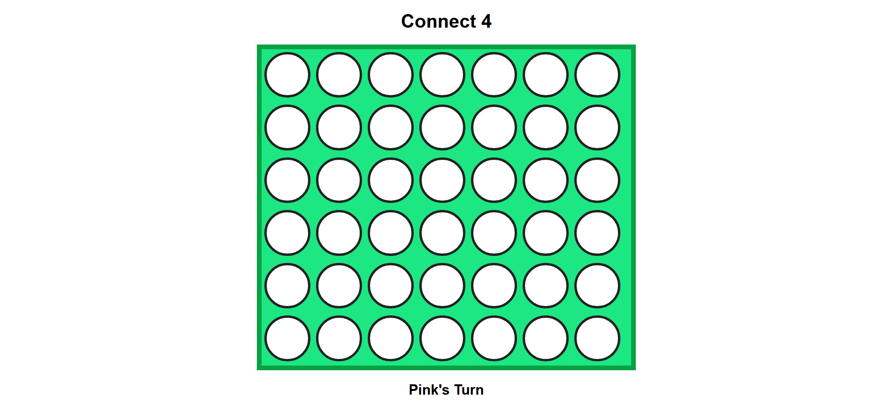
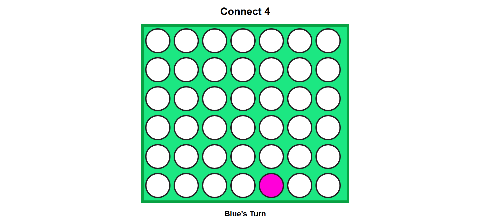
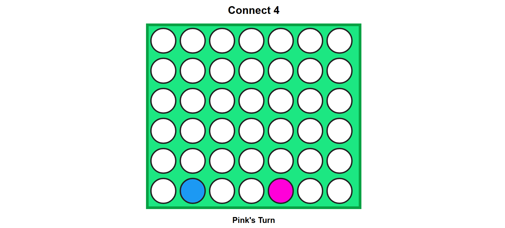
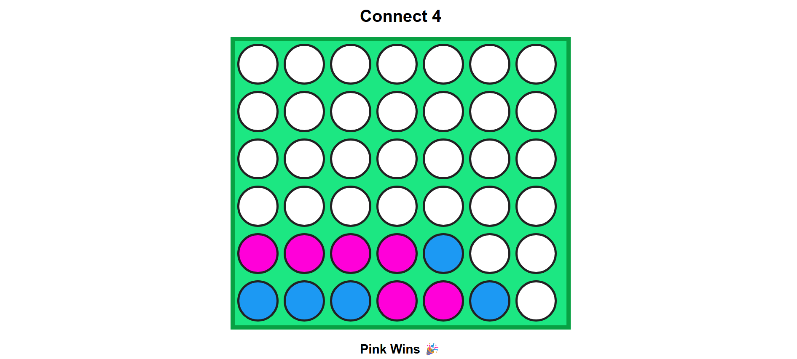

# Connect Four – Web Game

Interactive Connect Four browser game built using HTML, CSS, and JavaScript with logic for player turns and win detection.

Connect Four is a browser-based strategy game where two players take turns dropping colored discs into a vertical grid. The objective is to be the first player to connect four discs in a row — horizontally, vertically, or diagonally.

This project was developed to understand game logic implementation, event handling, and dynamic UI updates using JavaScript. It focuses on creating an interactive and engaging front-end experience.

## How to Play
- The game is played by two players.
- Players take turns selecting a column.
- A disc is placed in the lowest available slot in that column.
- The first player to connect four discs in a row wins.
- If the grid fills without a winner, the game ends in a draw.

## Features
- Two-player turn-based gameplay
- Real-time board updates
- Win detection logic (horizontal, vertical, diagonal)
- Simple and clean UI
- Interactive click-based controls

## Tech Stack
- HTML
- CSS
- JavaScript

## Logic Used
- Grid-based layout for the board structure
- Event listeners to capture player moves
- Turn switching logic between players
- Algorithm to check four connected discs in:
  - Horizontal direction
  - Vertical direction
  - Diagonal direction
- Game state tracking and result display

## What I Learned
- Implementing game logic using JavaScript
- Handling user interaction in real time
- Managing game states and conditions
- Building dynamic UI updates
- Structuring logic for win detection algorithms

## Project Purpose
This project represents hands-on experience in building an interactive browser game. It demonstrates logical thinking, problem-solving, and the ability to implement rule-based functionality using front-end technologies.

## Screenshots

### Game Start (Board before playing)

### Player Move – 1

### Player Move – 2

### Winning State

## Author
V Selvakumar
